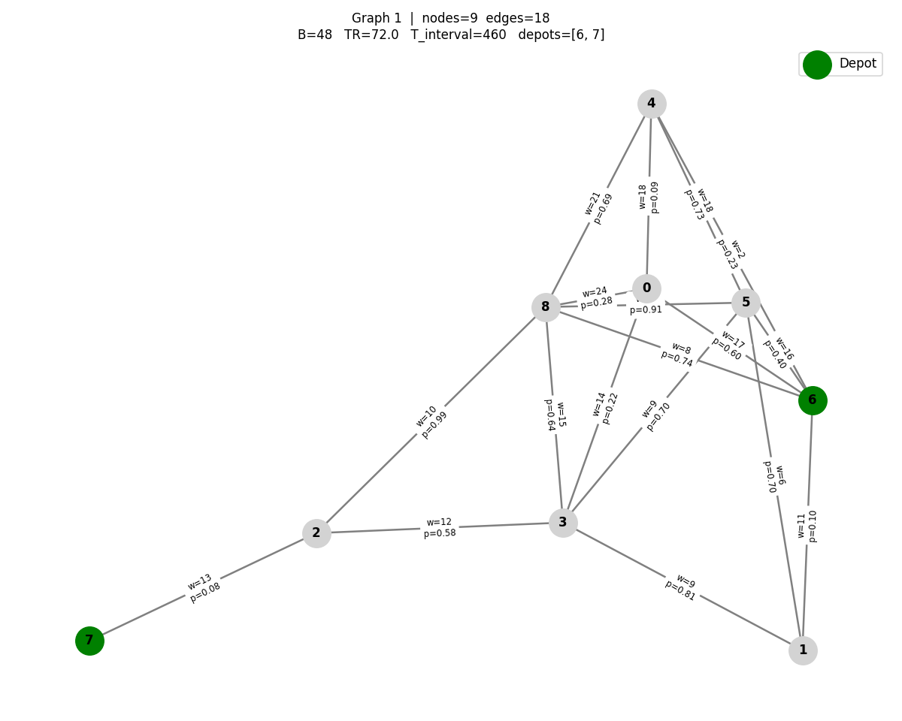

# Temporal Road-Icing Prediction (Dissertation Codebase)

This repository provides a complete, reproducible experimental pipeline for road-icing prediction on static road graphs with daily temporal features (weather, historical ice status, and network structure). 

The primary novel contribution is the evaluation of a Temporal Graph Neural Network (StaticEdgeGNN / TemporalEdgeGNN) acting on node-level historical sequences to predict daily edge-level freezing events, compared against strong sequence-based and tabular baseline models.

## Project Structure

```text
project_root/
├── build_temporal_dataset.py     # Parses raw graph CSVs, generates lag/rolling features, makes chronological split
├── train_gnn_temporal.py         # Trains PyTorch Geometric models (GCN/GAT/SAGE) with temporal features
├── train_lstm.py                 # Trains PyTorch LSTM sequential baseline for road-ice events
├── train_tabular_baselines.py    # Trains Logistic Regression, XGBoost, Random Forest, SVM, MLP
├── evaluate_all.py               # Aggregates metrics to produce a final leaderboard
├── export_results.py             # Exports summary metrics and configuration to an XLSX workbook
├── verify_pipeline.py            # Runs integrity checks on folders, data, overlapping splits, and NaNs
├── plot_gnn_routing_results.py   # Visualizes performance of routing algorithms across the real-world dataset
├── plot_icy_distribution.py      # Visualizes the ground truth distribution of icy nodes for real-world instances
├── config/
│   └── default_config.yaml       # Master configuration specifying data columns, lags, hyperparams, and split ratios
├── utils/
│   ├── feature_utils.py          # Lag & rolling window generation
│   ├── graph_utils.py            # Static edge creation and PyG snapshot builders
│   ├── io_utils.py               # Loggers and YAML loading
│   ├── metrics_utils.py          # PR-AUC, F1, ROC-AUC, threshold sweep tools, and plotting
│   └── split_utils.py            # Chronological splitting to strictly prevent future leakage
├── models/
│   ├── lstm_baseline.py          # Sequential LSTM architecture
│   ├── tabular_models.py         # Sklearn/XGBoost registry
│   └── temporal_gnn.py           # GNN architecture
├── data/                         # Processed datasets and schema reports (generated)
├── real_world_instances/         # Raw input CSVs (from OSMnx + Open-Meteo generation scripts) for US cities
├── synthetic_routing_dataset/    # Locally generated synthetic random graphs for routing logic development
├── multi_period_routing/         # Core folder hosting Simulated Annealing (SA) routing methods, and GNN inference wrappers
├── routing_results/              # Contains algorithm execution metrics and plotting outputs for graphs
├── GNN_training/                 # Specialized scripts related specifically to GNN pipeline training
└── outputs/                      # Generated models, metrics, plots, configs, and logs
```

## How Raw Data is Interpreted

The pipeline is designed to process road weather data separated into two primary buckets: **synthetic** and **real-world** instances.

### 1. `real_world_instances/`
This directory holds the raw CSV data for US cities like Arlington, Boston, Nashville, etc., mapping real geographical locations to node-level meteorological data.
- **Entity**: The raw CSVs are **node-day based** (`node_id`, `date`). 
- **Edges**: The structure is implicitly defined by `edge_list`. 
- **Visualization**: To view the distribution of ground-truth icy events across these cities over time, run `python plot_icy_distribution.py`. This reads directly from `real_world_instances/` and produces histograms under `histogram_ground_truth_distribution/`.
- **GNN Mapping**: `train_gnn_temporal.py` builds a global static `edge_index` across all nodes. Node features are processed, and the final edge prediction takes place using a classification head over concatenated node embeddings. An edge is considered `icy_label = 1` if either of its incident nodes are frozen.

### 2. `synthetic_routing_dataset/`
A suite of purely random, 8-15 node fully-connected graph instances engineered specifically to stress-test the simulated annealing routing frameworks locally without depending on massive OSM data overhead. 
- **Usage**: Typically generated and updated via `multi_period_routing/generate_graphs.py`. These datasets expose simpler `node` lists alongside probabilistic `weights` representing synthesized road clearance times and ice probabilities. They inform the SA algorithm baseline comparisons and feature pre-placed depot node markers.
- **Visualization**: When executing `multi_period_routing/generate_graphs.py`, topological images for every underlying `.pickle` instance are drawn to visually map where depots lay concerning their undirected probabilistic edges in `synthetic_routing_dataset/`.

Here is an example structure of a synthetic dataset graph showing randomly distributed edge travel weights, edge probabilities, and automatically configured depot positioning:


### Analyzing Final Routing Results
Once routing executions (using the Intelligent Memory vs Baseline caches on the GNN predicted graphs) conclude, they yield metrics into `routing_results/`. You can visually digest node coverage vs algorithm execution times by running:
```bash
python plot_gnn_routing_results.py
```
This generates grouped aesthetic comparison bar charts with error thresholds to help you definitively isolate the best routing approaches per instance.

## Experimental Controls & Fairness

- **Chronological Split Only**: To simulate real-world deployment and strictly prevent leakage, the dataset is ordered by time and split cleanly (e.g., 70% Train, 15% Validation, 15% Test). Random row-sampling is disallowed.
- **Fair Features**: Tabular models receive "flattened" temporal features (e.g., `temp_lag1`, `temp_lag2`), whereas the LSTM natively digests sequences. The GNN relies on the exact same flattened temporal history as base node features before graph propagation.
- **Metric Priority**: Road-icing is naturally **imbalanced**. Models optimize over `BCEWithLogitsLoss` using dynamic positive weighting (`pos_weight`), and early stopping strictly monitors **PR-AUC** over accuracy/ROC-AUC. Validation data determines the perfect decision threshold before testing.

## Execution Requirements

First, install dependencies:
```bash
pip install -r requirements.txt
```

### End-to-End Run Order

1. **Build the Temporal Features & Splits**:
   ```bash
   python build_temporal_dataset.py
   ```
   *Expected Output*: `data/processed_tabular.csv` and `data/schema_report.json`.

2. **Train Models**:
   ```bash
   python train_tabular_baselines.py
   python train_lstm.py
   python train_gnn_temporal.py
   ```
   *Expected Output*: Trained `*.pkl`/`*.pt` models in `outputs/models/`, metrics in `outputs/metrics/`, plots in `outputs/plots/`, and predictions in `outputs/predictions/`.

3. **Evaluate & Summarize**:
   ```bash
   python evaluate_all.py
   python export_results.py
   ```
   *Expected Output*: `summary_metrics.csv` and `summary_metrics.xlsx` in `outputs/metrics/`.

4. **Verify Constraints**:
   ```bash
   python verify_pipeline.py
   ```

## Troubleshooting
- **Missing Columns/NaNs**: If `build_temporal_dataset.py` drops too many rows, adjust the `lag_days` in `config/default_config.yaml`.
- **No Edges in GNN**: Ensure your raw CSV contains the `edge_list` string column correctly formatted (e.g. `"[1, 2, 3]"`).
- **Class Imbalance Failure**: If test PR-AUC is `0.0`, the specific period evaluated may have had absolutely zero freezing events. Try verifying the output of `openmatro.py` to ensure ice occurs during the test sequence.
